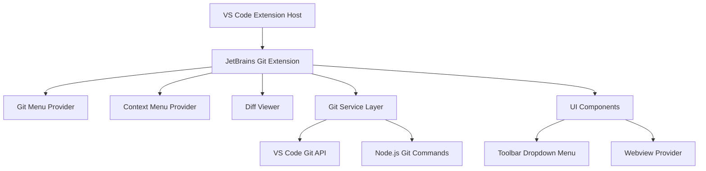

# Design Document

## Overview

The JetBrains Git Extension for VS Code will be implemented as a TypeScript-based VS Code extension that enhances the existing Git functionality with JetBrains IDE-style features. The extension will provide a comprehensive Git menu, context-sensitive file operations, and an advanced diff viewer with automatic conflict resolution.

The extension will integrate seamlessly with VS Code's existing Git functionality by leveraging the VS Code Extension API, Git Extension API, and the built-in Git support. It will not replace VS Code's Git features but rather enhance them with additional JetBrains-style workflows.

## Architecture

### High-Level Architecture



### Core Components

1. **Extension Entry Point** (`extension.ts`)
   - Registers commands, providers, and UI components
   - Manages extension lifecycle and activation events
   - Registers toolbar dropdown menu button

2. **Git Service Layer** (`services/gitService.ts`)
   - Abstracts Git operations using VS Code's Git API and direct Git commands
   - Handles branch management, file operations, and repository state

3. **Git Menu Provider** (`providers/gitMenuProvider.ts`)
   - Implements toolbar dropdown menu for the main Git menu
   - Manages branch hierarchy and common task sections
   - Handles menu item selection and submenu navigation

4. **Context Menu Provider** (`providers/contextMenuProvider.ts`)
   - Registers comprehensive Git context menu items
   - Handles repository operations (push, pull, fetch, merge, rebase)
   - Manages branch operations (new branch, new tag, branch menu)
   - Provides file-specific Git operations (history, compare, annotate, revert)
   - Handles advanced operations (reset, stash, remotes)

5. **Diff Viewer** (`views/diffViewer.ts`)
   - Custom webview-based diff interface
   - Implements conflict resolution UI

6. **Conflict Resolver** (`services/conflictResolver.ts`)
   - Automatic conflict resolution logic
   - Manual conflict resolution helpers

## Components and Interfaces

### Git Service Interface

```typescript
interface IGitService {
  // Branch operations
  getBranches(): Promise<Branch[]>;
  createBranch(name: string, startPoint?: string): Promise<void>;
  checkoutBranch(name: string): Promise<void>;
  renameBranch(oldName: string, newName: string): Promise<void>;
  
  // Repository operations
  fetch(): Promise<void>;
  pull(): Promise<void>;
  push(branch?: string): Promise<void>;
  commit(message: string): Promise<void>;
  merge(branch: string): Promise<void>;
  rebase(branch: string): Promise<void>;
  
  // Advanced operations
  resetHead(mode: 'soft' | 'mixed' | 'hard', commit?: string): Promise<void>;
  stashChanges(message?: string): Promise<void>;
  unstashChanges(stashIndex?: number): Promise<void>;
  createTag(name: string, message?: string): Promise<void>;
  
  // Remote operations
  getRemotes(): Promise<Remote[]>;
  addRemote(name: string, url: string): Promise<void>;
  removeRemote(name: string): Promise<void>;
  
  // File operations
  getFileHistory(filePath: string): Promise<CommitInfo[]>;
  getFileDiff(filePath: string, ref1?: string, ref2?: string): Promise<DiffResult>;
  revertFile(filePath: string): Promise<void>;
}
```

### Branch Data Model

```typescript
interface Branch {
  name: string;
  fullName: string;
  type: 'local' | 'remote';
  isActive: boolean;
  upstream?: string;
  ahead?: number;
  behind?: number;
  lastCommit?: CommitInfo;
}

interface BranchGroup {
  prefix: string;
  branches: Branch[];
  isCollapsed: boolean;
}

interface Remote {
  name: string;
  fetchUrl: string;
  pushUrl: string;
  branches: string[];
}

interface StashEntry {
  index: number;
  message: string;
  branch: string;
  timestamp: Date;
}
```

### Main Git Menu Structure

The Git menu will be implemented as a dropdown button in the VS Code toolbar (similar to the Command Center location) with the following structure:

```
Git ▼ (Toolbar Dropdown)
├── Common Tasks
│   ├── Update Project
│   ├── Commit Changes
│   ├── Push
│   └── Fetch
├── ─────────────────
├── Local Branches
│   ├── ● main (current)
│   ├── feature/ ▶
│   │   ├── feature/auth
│   │   └── feature/ui-improvements
│   └── bugfix/ ▶
│       └── bugfix/login-issue
├── ─────────────────
└── Remote Branches
    ├── origin/main
    ├── origin/develop
    └── upstream/main
```

The dropdown will be positioned in the toolbar area and provide hierarchical navigation with expandable branch groups.

### Context Menu Integration

File context menus will be extended with a "Git" submenu containing:

**Repository Operations:**
- Push
- Pull
- Fetch
- Merge
- Rebase

**Branch Management:**
- Branches (show branch menu)
- New Branch
- New Tag

**File Operations:**
- Show History
- Show Current Version
- Compare with Branch
- Compare with Revision
- Annotate (Blame)
- Revert

**Advanced Operations:**
- Reset HEAD
- Stash Changes
- Unstash Changes
- Manage Remotes

## Data Models

### Diff Data Model

```typescript
interface DiffResult {
  filePath: string;
  oldContent: string;
  newContent: string;
  hunks: DiffHunk[];
  hasConflicts: boolean;
  conflicts?: ConflictRegion[];
}

interface DiffHunk {
  oldStart: number;
  oldLines: number;
  newStart: number;
  newLines: number;
  lines: DiffLine[];
}

interface DiffLine {
  type: 'added' | 'removed' | 'unchanged' | 'conflict';
  content: string;
  oldLineNumber?: number;
  newLineNumber?: number;
}
```

### Conflict Resolution Model

```typescript
interface ConflictRegion {
  startLine: number;
  endLine: number;
  currentContent: string;
  incomingContent: string;
  baseContent?: string;
  isResolved: boolean;
  resolution?: 'current' | 'incoming' | 'both' | 'manual';
}
```

## Error Handling

### Error Categories

1. **Git Operation Errors**
   - Repository not found
   - Branch conflicts
   - Merge conflicts
   - Network connectivity issues

2. **File System Errors**
   - File not found
   - Permission denied
   - File locked by another process

3. **VS Code Integration Errors**
   - Extension API failures
   - Command registration failures
   - UI component failures

### Error Handling Strategy

```typescript
class GitError extends Error {
  constructor(
    message: string,
    public code: string,
    public category: 'git' | 'filesystem' | 'vscode',
    public recoverable: boolean = true
  ) {
    super(message);
  }
}

interface ErrorHandler {
  handleError(error: GitError): Promise<void>;
  showUserFriendlyMessage(error: GitError): void;
  logError(error: GitError): void;
}
```

### User Feedback

- Progress indicators for long-running operations
- Toast notifications for operation results
- Status bar integration for Git status
- Error dialogs with actionable suggestions

## Testing Strategy

### Unit Testing

- **Git Service Layer**: Mock Git operations and test business logic
- **Conflict Resolver**: Test automatic resolution algorithms
- **Data Models**: Validate data transformation and validation logic
- **Utility Functions**: Test helper functions and formatters

### Integration Testing

- **VS Code API Integration**: Test command registration and execution
- **Git Repository Operations**: Test against real Git repositories
- **UI Component Integration**: Test tree view and webview interactions
- **File System Operations**: Test file watching and modification handling

### End-to-End Testing

- **Complete Workflows**: Test full user scenarios from menu to completion
- **Error Scenarios**: Test error handling and recovery paths
- **Performance Testing**: Test with large repositories and many branches
- **Cross-Platform Testing**: Ensure compatibility across Windows, macOS, and Linux

### Test Structure

```
tests/
├── unit/
│   ├── services/
│   ├── providers/
│   └── utils/
├── integration/
│   ├── git-operations/
│   ├── vscode-api/
│   └── ui-components/
└── e2e/
    ├── workflows/
    ├── error-scenarios/
    └── performance/
```

### Testing Tools

- **Jest**: Unit and integration testing framework
- **VS Code Test Runner**: Extension-specific testing utilities
- **Mock Git Repositories**: Controlled test environments
- **Sinon**: Mocking and stubbing for external dependencies

## Implementation Phases

### Phase 1: Core Infrastructure
- Extension scaffolding and activation
- Git service layer implementation
- Basic command registration

### Phase 2: Git Menu Implementation
- Tree view provider for branch listing
- Branch grouping and hierarchy
- Common task section

### Phase 3: Context Menu Integration
- File context menu registration
- File history and diff operations
- File-specific Git commands

### Phase 4: Advanced Diff Viewer
- Custom webview implementation
- Side-by-side diff display
- Navigation and interaction controls

### Phase 5: Conflict Resolution
- Automatic conflict detection
- Resolution algorithms
- Manual resolution UI

### Phase 6: Polish and Testing
- Comprehensive test suite
- Error handling improvements
- Performance optimizations
- Documentation and examples