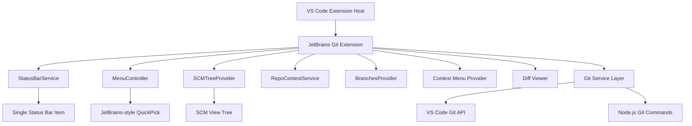

# Design Document

## Overview

The JetBrains Git Extension for VS Code will be implemented as a TypeScript-based VS Code extension that provides JetBrains IDE-style Git functionality through a unified interface. The extension features a single status bar entry that opens a JetBrains-style QuickPick menu, an SCM view for persistent Git information, and advanced diff viewing with automatic conflict resolution.

The extension will integrate seamlessly with VS Code's existing Git functionality by leveraging the VS Code Extension API, Git Extension API, and the built-in Git support. It provides a clean, efficient interface that adapts to single-repo and multi-repo workspaces while maintaining compatibility with VS Code's Git features.

## Architecture

### High-Level Architecture



### Core Components

1. **Extension Entry Point** (`extension.ts`)
   - Registers commands, providers, and UI components
   - Manages extension lifecycle and activation events
   - Initializes StatusBarService and RepoContextService

2. **StatusBarService** (`services/statusBarService.ts`)
   - Manages single status bar item with repository-aware text
   - Updates status based on single-repo vs multi-repo context
   - Handles click events to open QuickPick menu

3. **MenuController** (`providers/menuController.ts`)
   - Implements JetBrains-style QuickPick menu
   - Detects single vs multi-repo and renders appropriate layout
   - Provides items with alwaysShow for top actions and separators for sections

4. **RepoContextService** (`services/repoContextService.ts`)
   - Tracks active repository and emits change events
   - Provides listRepositories(), getActiveRepository(), setActiveRepository() methods
   - Manages MRU (Most Recently Used) branch tracking per repository

5. **BranchesProvider** (`providers/branchesProvider.ts`)
   - Provides getRecent(), getLocal(), getRemotes(), getTags() methods
   - Returns items with divergence badges and MRU metadata
   - Caches branch lists and refreshes on repository changes

6. **SCMTreeProvider** (`providers/scmTreeProvider.ts`)
   - TreeDataProvider for SCM view sections: Recent, Local, Remote, Tags, Changelists
   - Context menu items mirror QuickPick actions
   - Refreshes on repository change events

7. **Context Menu Provider** (`providers/contextMenuProvider.ts`)
   - Registers comprehensive Git context menu items
   - Handles repository operations (push, pull, fetch, merge, rebase)
   - Manages branch operations (new branch, new tag, branch menu)
   - Provides file-specific Git operations (history, compare, annotate, revert)
   - Handles advanced operations (reset, stash, remotes)

8. **Git Service Layer** (`services/gitService.ts`)
   - Abstracts Git operations using VS Code's Git API and direct Git commands
   - Handles branch management, file operations, and repository state
   - Uses vscode.extensions.getExtension('vscode.git').exports.getAPI(1)

9. **Diff Viewer** (`views/diffViewer.ts`)
   - Custom webview-based diff interface
   - Implements conflict resolution UI

10. **Conflict Resolver** (`services/conflictResolver.ts`)
    - Automatic conflict resolution logic
    - Manual conflict resolution helpers

## Components and Interfaces

### Git Service Interface

```typescript
interface IGitService {
  // Branch operations
  getBranches(): Promise<Branch[]>;
  createBranch(name: string, startPoint?: string): Promise<void>;
  checkoutBranch(name: string): Promise<void>;
  renameBranch(oldName: string, newName: string): Promise<void>;
  
  // Repository operations
  fetch(): Promise<void>;
  pull(): Promise<void>;
  push(branch?: string): Promise<void>;
  commit(message: string): Promise<void>;
  merge(branch: string): Promise<void>;
  rebase(branch: string): Promise<void>;
  
  // Advanced operations
  resetHead(mode: 'soft' | 'mixed' | 'hard', commit?: string): Promise<void>;
  stashChanges(message?: string): Promise<void>;
  unstashChanges(stashIndex?: number): Promise<void>;
  createTag(name: string, message?: string): Promise<void>;
  
  // Remote operations
  getRemotes(): Promise<Remote[]>;
  addRemote(name: string, url: string): Promise<void>;
  removeRemote(name: string): Promise<void>;
  
  // File operations
  getFileHistory(filePath: string): Promise<CommitInfo[]>;
  getFileDiff(filePath: string, ref1?: string, ref2?: string): Promise<DiffResult>;
  revertFile(filePath: string): Promise<void>;
}
```

### Data Models

#### Repository Context Model
```typescript
interface Repository {
  rootUri: vscode.Uri;
  name: string;
  currentBranch?: string;
  ahead?: number;
  behind?: number;
  hasChanges: boolean;
}

interface RepoContextService {
  listRepositories(): Repository[];
  getActiveRepository(): Repository | undefined;
  setActiveRepository(repo: Repository): void;
  onDidChangeActiveRepository: vscode.Event<Repository | undefined>;
}
```

#### Branch Data Model
```typescript
interface Branch {
  name: string;
  fullName: string;
  type: 'local' | 'remote';
  isActive: boolean;
  upstream?: string;
  ahead?: number;
  behind?: number;
  lastCommit?: CommitInfo;
  lastAccessed?: Date; // For MRU tracking
}

interface BranchGroup {
  prefix: string;
  branches: Branch[];
  isCollapsed: boolean;
}

interface Remote {
  name: string;
  fetchUrl: string;
  pushUrl: string;
  branches: string[];
}

interface StashEntry {
  index: number;
  message: string;
  branch: string;
  timestamp: Date;
}

interface Tag {
  name: string;
  commit: string;
  message?: string;
  tagger?: string;
  date?: Date;
}
```

#### QuickPick Item Models
```typescript
interface QuickPickBranchItem extends vscode.QuickPickItem {
  branch: Branch;
  type: 'branch';
  repository?: Repository;
}

interface QuickPickActionItem extends vscode.QuickPickItem {
  action: string;
  type: 'action';
  alwaysShow: true;
}

interface QuickPickRepositoryItem extends vscode.QuickPickItem {
  repository: Repository;
  type: 'repository';
}

interface QuickPickSeparatorItem extends vscode.QuickPickItem {
  type: 'separator';
  kind: vscode.QuickPickItemKind.Separator;
}
```

#### Settings Model
```typescript
interface JetGitSettings {
  statusBar: {
    enabled: boolean;
  };
  scmView: {
    enabled: boolean;
  };
  updateProject: {
    mode: 'pull' | 'pullRebase' | 'fetchRebaseInteractive';
  };
  showChangelists: boolean;
}
```
```

### JetBrains-Style QuickPick Menu Structure

The Git menu will be implemented as a QuickPick that opens when the status bar item is clicked, with adaptive layouts:

#### Single-Repo Layout
```
Search for branches and actions
┌─────────────────────────────────────┐
│ $(sync) Update Project…             │
│ $(git-commit) Commit…               │
│ $(arrow-up) Push…                   │
├─────────────────────────────────────┤
│ $(git-branch) New Branch…           │
│ $(tag) Checkout Tag or Revision…    │
├─────────────────────────────────────┤
│ Recent                              │
│   $(git-branch) feature/auth        │
│   $(git-branch) bugfix/login        │
│ Local                               │
│   ⭐ $(git-branch) main              │
│   $(git-branch) develop             │
│   feature/ ▶                        │
│     $(git-branch) feature/auth      │
│     $(git-branch) feature/ui        │
│ Remote                              │
│   $(cloud) origin/main              │
│   $(cloud) origin/develop           │
│ Tags                                │
│   $(tag) v1.0.0                     │
└─────────────────────────────────────┘
```

#### Multi-Repo Layout
```
Search for branches and actions
┌─────────────────────────────────────┐
│ ⚠ Branches have diverged            │
├─────────────────────────────────────┤
│ $(folder) frontend • main ↑2        │
│ $(folder) backend • develop         │
│ $(folder) shared • main             │
├─────────────────────────────────────┤
│ Common Local Branches               │
│   $(git-branch) main                │
│   $(git-branch) develop             │
│ Common Remote Branches              │
│   $(cloud) origin/main              │
│   $(cloud) origin/develop           │
└─────────────────────────────────────┘
```

### SCM View Structure

The SCM view will be implemented as a TreeDataProvider with the following structure:

```
Git (JetBrains)
├── Recent
│   ├── feature/auth
│   └── bugfix/login
├── Local
│   ├── ⭐ main (current)
│   ├── develop
│   └── feature/
│       ├── feature/auth
│       └── feature/ui
├── Remote
│   ├── origin/
│   │   ├── origin/main
│   │   └── origin/develop
│   └── upstream/
│       └── upstream/main
├── Tags
│   ├── v1.0.0
│   └── v0.9.0
└── Changelists (if enabled)
    ├── Default
    └── Feature Work
```

### Context Menu Integration

File context menus will be extended with a "Git" submenu containing:

**Repository Operations:**
- Push
- Pull
- Fetch
- Merge
- Rebase

**Branch Management:**
- Branches (show branch menu)
- New Branch
- New Tag

**File Operations:**
- Show History
- Show Current Version
- Compare with Branch
- Compare with Revision
- Annotate (Blame)
- Revert

**Advanced Operations:**
- Reset HEAD
- Stash Changes
- Unstash Changes
- Manage Remotes

## Data Models

### Diff Data Model

```typescript
interface DiffResult {
  filePath: string;
  oldContent: string;
  newContent: string;
  hunks: DiffHunk[];
  hasConflicts: boolean;
  conflicts?: ConflictRegion[];
}

interface DiffHunk {
  oldStart: number;
  oldLines: number;
  newStart: number;
  newLines: number;
  lines: DiffLine[];
}

interface DiffLine {
  type: 'added' | 'removed' | 'unchanged' | 'conflict';
  content: string;
  oldLineNumber?: number;
  newLineNumber?: number;
}
```

### Conflict Resolution Model

```typescript
interface ConflictRegion {
  startLine: number;
  endLine: number;
  currentContent: string;
  incomingContent: string;
  baseContent?: string;
  isResolved: boolean;
  resolution?: 'current' | 'incoming' | 'both' | 'manual';
}
```

## Error Handling

### Error Categories

1. **Git Operation Errors**
   - Repository not found
   - Branch conflicts
   - Merge conflicts
   - Network connectivity issues

2. **File System Errors**
   - File not found
   - Permission denied
   - File locked by another process

3. **VS Code Integration Errors**
   - Extension API failures
   - Command registration failures
   - UI component failures

### Error Handling Strategy

```typescript
class GitError extends Error {
  constructor(
    message: string,
    public code: string,
    public category: 'git' | 'filesystem' | 'vscode',
    public recoverable: boolean = true
  ) {
    super(message);
  }
}

interface ErrorHandler {
  handleError(error: GitError): Promise<void>;
  showUserFriendlyMessage(error: GitError): void;
  logError(error: GitError): void;
}
```

### User Feedback

- Progress indicators for long-running operations
- Toast notifications for operation results
- Status bar integration for Git status
- Error dialogs with actionable suggestions

## Testing Strategy

### Unit Testing

- **Git Service Layer**: Mock Git operations and test business logic
- **Conflict Resolver**: Test automatic resolution algorithms
- **Data Models**: Validate data transformation and validation logic
- **Utility Functions**: Test helper functions and formatters

### Integration Testing

- **VS Code API Integration**: Test command registration and execution
- **Git Repository Operations**: Test against real Git repositories
- **UI Component Integration**: Test tree view and webview interactions
- **File System Operations**: Test file watching and modification handling

### End-to-End Testing

- **Complete Workflows**: Test full user scenarios from menu to completion
- **Error Scenarios**: Test error handling and recovery paths
- **Performance Testing**: Test with large repositories and many branches
- **Cross-Platform Testing**: Ensure compatibility across Windows, macOS, and Linux

### Test Structure

```
tests/
├── unit/
│   ├── services/
│   ├── providers/
│   └── utils/
├── integration/
│   ├── git-operations/
│   ├── vscode-api/
│   └── ui-components/
└── e2e/
    ├── workflows/
    ├── error-scenarios/
    └── performance/
```

### Testing Tools

- **Jest**: Unit and integration testing framework
- **VS Code Test Runner**: Extension-specific testing utilities
- **Mock Git Repositories**: Controlled test environments
- **Sinon**: Mocking and stubbing for external dependencies

## Package.json Contributions

### Extension Dependencies
```json
{
  "extensionDependencies": ["vscode.git"]
}
```

### Settings Contributions
```json
{
  "configuration": {
    "title": "JetGit",
    "properties": {
      "jbGit.statusBar.enabled": {
        "type": "boolean",
        "default": true,
        "description": "Enable the JetGit status bar item"
      },
      "jbGit.scmView.enabled": {
        "type": "boolean", 
        "default": true,
        "description": "Enable the JetGit SCM view"
      },
      "jbGit.updateProject.mode": {
        "type": "string",
        "enum": ["pull", "pullRebase", "fetchRebaseInteractive"],
        "default": "pullRebase",
        "description": "Mode for Update Project operation"
      },
      "jbGit.showChangelists": {
        "type": "boolean",
        "default": false,
        "description": "Show changelists in SCM view and menus"
      }
    }
  }
}
```

### Views Contributions
```json
{
  "views": {
    "scm": [
      {
        "id": "jbGit.explorer",
        "name": "Git (JetBrains)",
        "when": "config.jbGit.scmView.enabled && gitOpenRepositoryCount != 0"
      }
    ]
  }
}
```

### Commands Contributions
```json
{
  "commands": [
    {
      "command": "jbGit.openMenu",
      "title": "Open Git Menu",
      "category": "JetGit"
    },
    {
      "command": "jbGit.createBranch", 
      "title": "Create Branch",
      "category": "JetGit"
    },
    {
      "command": "jbGit.checkoutRef",
      "title": "Checkout Tag or Revision",
      "category": "JetGit"
    },
    {
      "command": "jbGit.updateProject",
      "title": "Update Project",
      "category": "JetGit"
    },
    {
      "command": "jbGit.commit",
      "title": "Commit",
      "category": "JetGit"
    },
    {
      "command": "jbGit.push",
      "title": "Push", 
      "category": "JetGit"
    },
    {
      "command": "jbGit.showHistory",
      "title": "Show History",
      "category": "JetGit"
    },
    {
      "command": "jbGit.createChangelist",
      "title": "Create Changelist",
      "category": "JetGit",
      "when": "config.jbGit.showChangelists"
    },
    {
      "command": "jbGit.commitChangelist",
      "title": "Commit Changelist", 
      "category": "JetGit",
      "when": "config.jbGit.showChangelists"
    },
    {
      "command": "jbGit.refreshSCM",
      "title": "Refresh",
      "icon": "$(refresh)"
    },
    {
      "command": "jbGit.switchRepository",
      "title": "Switch Repository",
      "icon": "$(repo)"
    }
  ]
}
```

### Menus Contributions
```json
{
  "menus": {
    "view/title": [
      {
        "command": "jbGit.switchRepository",
        "when": "view == jbGit.explorer && gitOpenRepositoryCount > 1",
        "group": "navigation@1"
      },
      {
        "command": "jbGit.refreshSCM",
        "when": "view == jbGit.explorer",
        "group": "navigation@2"
      },
      {
        "command": "jbGit.createBranch",
        "when": "view == jbGit.explorer",
        "group": "1_actions@1"
      },
      {
        "command": "jbGit.createChangelist",
        "when": "view == jbGit.explorer && config.jbGit.showChangelists",
        "group": "1_actions@2"
      }
    ],
    "view/item/context": [
      {
        "command": "jbGit.checkoutRef",
        "when": "view == jbGit.explorer && viewItem == branch",
        "group": "1_branch@1"
      }
    ]
  }
}
```

## Implementation Phases

### Phase 1: Architecture Refactoring
- Remove duplicate status bar items
- Create StatusBarService singleton
- Implement RepoContextService for multi-repo support
- Basic QuickPick menu structure

### Phase 2: JetBrains-Style QuickPick
- Single-repo and multi-repo layout detection
- Top actions section with proper formatting
- Branch sections with grouping and MRU
- Performance optimization for large repositories

### Phase 3: SCM View Implementation
- TreeDataProvider for persistent Git information
- View title actions and context menus
- Integration with repository context changes
- Settings-based visibility controls

### Phase 4: Data Providers and Caching
- BranchesProvider with divergence badges
- MRU tracking and persistence
- Repository change event handling
- Performance optimization and debouncing

### Phase 5: Commands and Actions Integration
- Wire all QuickPick actions to commands
- Command Palette registration
- Keyboard navigation and type-ahead filtering
- Settings and feature flag implementation

### Phase 6: Testing and Polish
- Comprehensive test suite for new architecture
- Performance testing for 150ms requirement
- JetBrains-style UI polish and icon usage
- Documentation updates for new features